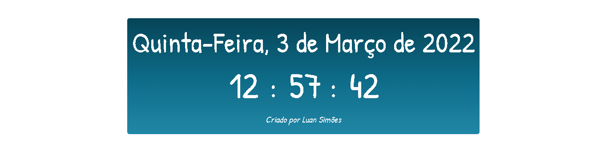
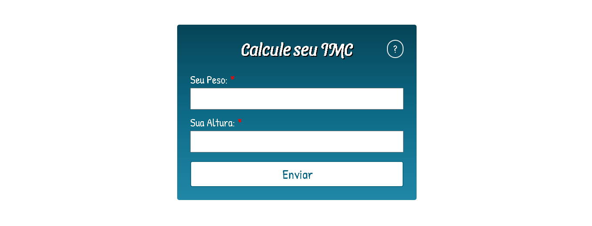

# Learning JavaScript
 Meu aprendizado com javascript na Udemy

 ✓ Working With Strings!  
 ✓ Working With Numbers!  
 ✓ Working With Object Math!  
 ✓ Working With Arrays JS!  
 ✓ Working With Function!  
 ✓ Working With Objects!  
 ✓ Working With Object Date!  
 ✓ Working With Swich Case!  
 ✓ Working With { Desestruturação } = Javascript!  
 ✓ Working With For!  
 ✓ Working With For Of!  
 ✓ Working With For In!  
 ✓ Working With NodeList!  
 ✓ Working With While and Do While!  
 ✓ Working With Break and Continue!  
 ✓ Working With Try Cath!  
 ✓ Working With SetInterval and setTimeout!  
 ✓ Working Constructor Functions And Factory!  
 ✓ Working With Filter, Map, Reduce!  
 ✓ Working With ForEach!  
 ✓ Working With Node.js!  
 ✓ Working With Webpack!  
 ✓ Working With Express!  
 ✓ Working With Mongoose!  
 ✓ Working With TypeScript!  
 ✓ Working With React!  
 ✓ Working With React-Redux!  
 ✓ Working With React-Dom!  
 ✓ Working With React-Icons!  
 ✓ Working With Axios!  

 <h1>✅Projects</h1>
 <h3>📚 Relógio</h3> 
 
 
 Ferramentas usadas: Date / setInterval / functions
 <h2></h2>

 <h3>📚 Cronômetro</h3> 
 
 Ferramentas usadas: Date / setInterval / functions / keyFrames
 <h2></h2>

<h3>📚 IMC</h3> 
 
 Ferramentas usadas: functions / keyFrames
 <h2></h2>

<h3>📚 Calculadora</h3> 
 
 Ferramentas usadas: functions
 <h2></h2>

<h3>📚 Lista</h3> 

 Ferramentas usadas: functions / JSON / LocalStorage  
 <h2></h2>
